# 🏗️ VIGIA Medical AI - System Architecture

## 🎯 **Overview**

VIGIA Medical AI is a **production-ready** pressure injury detection system that implements real medical protocols for healthcare environments. Unlike typical hackathon demos, this system features actual NPUAP/EPUAP 2019 clinical guidelines and HIPAA-compliant data protection.

---

## 🔐 **3-Layer Security Architecture**

### **Layer 1: Input Isolation**
- **WhatsApp Bot**: Patient communication interface
- **No Medical Data Access**: Receives images but no PHI
- **Token-Based Routing**: Converts requests to secure tokens

### **Layer 2: Medical Orchestration** 
- **PHI Tokenization Service**: Bruce Wayne → Batman conversion
- **Medical Triage Engine**: Risk assessment and routing
- **JWT Authentication**: Secure medical staff identification

### **Layer 3: Specialized Medical Systems**
- **LPP Detection Engine**: MONAI + YOLOv5 computer vision
- **Clinical Decision Engine**: Real NPUAP/EPUAP guidelines
- **Medical Team Collaboration**: Slack integration for physicians

```mermaid
graph TB
    A[Patient WhatsApp] --> B[Layer 1: Input Bot]
    B --> C[Layer 2: PHI Tokenizer]
    C --> D[Layer 3: Medical AI]
    D --> E[Medical Teams Slack]
    E --> F[Approved Response]
    F --> A
    
    subgraph "Security Boundaries"
        B["🔓 No PHI Access"]
        C["🔐 Token Conversion"]  
        D["🏥 Medical Processing"]
    end
```



---

## 🧠 **Medical AI Stack**

### **Computer Vision Pipeline**
- **Primary**: MONAI medical imaging framework
  - Optimized for medical image analysis
  - Pre-trained on medical datasets
  - HIPAA-compliant processing
- **Backup**: YOLOv5 computer vision
  - Robust general-purpose detection
  - Fast inference for real-time analysis
  - Proven accuracy in medical applications

### **Clinical Decision Engine**
- **NPUAP/EPUAP 2019 Guidelines**: Real clinical protocols
- **Evidence-Based Medicine**: Level A/B/C recommendations
- **Safety-First Design**: Low confidence → Human escalation
- **Medical Audit Trail**: Complete decision traceability

### **Medical Language AI**
- **MedGemma 27B**: Local medical language model
- **HIPAA Compliant**: No external data transmission
- **Medical Domain**: Specialized healthcare knowledge
- **Clinical Context**: Understanding of medical terminology

---

## 💬 **Communication Architecture**

### **Bidirectional Patient Flow**
```
Patient Submission → Medical Analysis → Physician Review → Patient Response
      ↓                    ↓                   ↓                ↓
   WhatsApp            VIGIA AI            Slack           WhatsApp
```

### **Google Cloud ADK Integration**
- **Multi-Agent Coordination**: Parallel medical processing
- **Workflow Orchestration**: Complex medical decision flows
- **Real-Time Communication**: Async agent messaging
- **Error Recovery**: Robust failure handling

### **Medical Team Collaboration**
- **Slack Integration**: Physician communication platform
- **Real-Time Notifications**: Urgent case escalation
- **Medical Review**: Human oversight for critical decisions
- **Team Coordination**: Multi-specialist consultation

---

## 🔒 **HIPAA Compliance & Security**

### **PHI Tokenization System**
```python
# Hospital Database (PHI)
patient_record = {
    "mrn": "MRN-2025-001-BW",  # Bruce Wayne
    "age": 75,
    "diabetes": True,
    "location": "Gotham General Hospital"
}

# Processing Database (Tokens)
batman_token = {
    "token_id": "batman-2025-001",  # Tokenized ID
    "age": 75,                      # Medical context only
    "diabetes": True,               # Risk factors
    "hospital_token": "gh_001"      # Hospital identifier
}
```

### **Security Features**
- **Data Separation**: Hospital PHI ≠ Processing tokens
- **Encryption**: Fernet symmetric encryption for sensitive data
- **Audit Trail**: Complete medical decision logging
- **Access Control**: Role-based medical staff permissions
- **Session Management**: Secure authentication tokens

---

## 📊 **Medical Decision Workflow**

### **Evidence-Based Decision Making**
1. **Image Analysis**: MONAI/YOLOv5 pressure injury detection
2. **Risk Assessment**: Patient context + medical history
3. **NPUAP Classification**: Grade 0-4 pressure injury staging
4. **Clinical Recommendations**: Evidence-based treatment protocols
5. **Escalation Logic**: High-risk cases → Immediate physician review

### **Real Medical Examples**
**Grade 4 Pressure Injury:**
```
Decision: "Urgent surgical evaluation required"
Timeline: "Immediate intervention within 15 minutes" 
Evidence: "NPUAP Strong Recommendation 7.1"
Escalation: "High priority medical team notification"
```

**Grade 2 Pressure Injury:**
```
Decision: "Moist wound healing with hydrocolloid dressings"
Timeline: "Assessment within 2 hours"
Evidence: "NPUAP/EPUAP Level A Evidence"
Monitoring: "Daily wound evaluation protocol"
```

---

## 🚀 **Performance & Scalability**

### **Async Processing Pipeline**
- **Celery Task Queue**: Background medical processing
- **Redis Caching**: Fast medical protocol retrieval
- **Load Balancing**: Multiple worker processes
- **Timeout Handling**: Prevents communication delays

### **Medical Data Performance**
- **Sub-second Analysis**: Fast medical decision making
- **Concurrent Processing**: Multiple patient cases
- **Real-Time Notifications**: Immediate physician alerts
- **Scalable Architecture**: Hospital-grade deployment

### **Monitoring & Observability**
- **Medical Telemetry**: Decision accuracy tracking
- **Performance Metrics**: Response time monitoring
- **Error Tracking**: Medical processing failures
- **Audit Compliance**: Regulatory reporting

---

## 🏥 **Production Deployment**

### **Hospital Environment**
- **Docker Containers**: Isolated medical services
- **Database Separation**: PHI vs Processing isolation
- **Network Security**: VPN + firewall protection
- **Backup Systems**: Medical data redundancy

### **Compliance Standards**
- **HIPAA**: Health Insurance Portability and Accountability Act
- **SOC 2 Type II**: Security operational controls
- **ISO 27001**: Information security management
- **IEC 62304**: Medical device software lifecycle

### **Integration Points**
- **HIS/EMR**: Hospital Information Systems
- **FHIR**: Fast Healthcare Interoperability Resources
- **HL7**: Health Level Seven messaging standards
- **DICOM**: Digital Imaging and Communications

---

## 🎯 **Hackathon Highlights**

### **What Makes This Different**
1. **Real Medical Functionality**: Not a prototype - implements actual NPUAP guidelines
2. **Production Security**: HIPAA-compliant with complete audit trails
3. **Advanced Architecture**: Google Cloud ADK multi-agent coordination
4. **Healthcare Integration**: Real bidirectional patient-physician communication
5. **Regulatory Ready**: Complete medical decision traceability

### **Technical Innovation**
- **PHI Tokenization**: Novel Bruce Wayne → Batman privacy protection
- **Medical AI Stack**: MONAI + YOLOv5 + MedGemma integration
- **Evidence-Based Engine**: Real clinical protocol implementation
- **Safety Mechanisms**: Automatic escalation for uncertain cases

---

## 📋 **Development & Testing**

### **Medical Validation**
- **Clinical Accuracy**: NPUAP guideline compliance testing
- **Safety Testing**: Low confidence case escalation
- **Integration Testing**: End-to-end medical workflows
- **Performance Testing**: Hospital-scale load simulation

### **Quality Assurance**
- **Medical Review**: Healthcare professional validation
- **Security Audit**: HIPAA compliance verification
- **Penetration Testing**: Security vulnerability assessment
- **Regression Testing**: Medical functionality preservation

---

**🩺 Built for Healthcare | 🔒 Secured for Compliance | 🚀 Ready for Production**